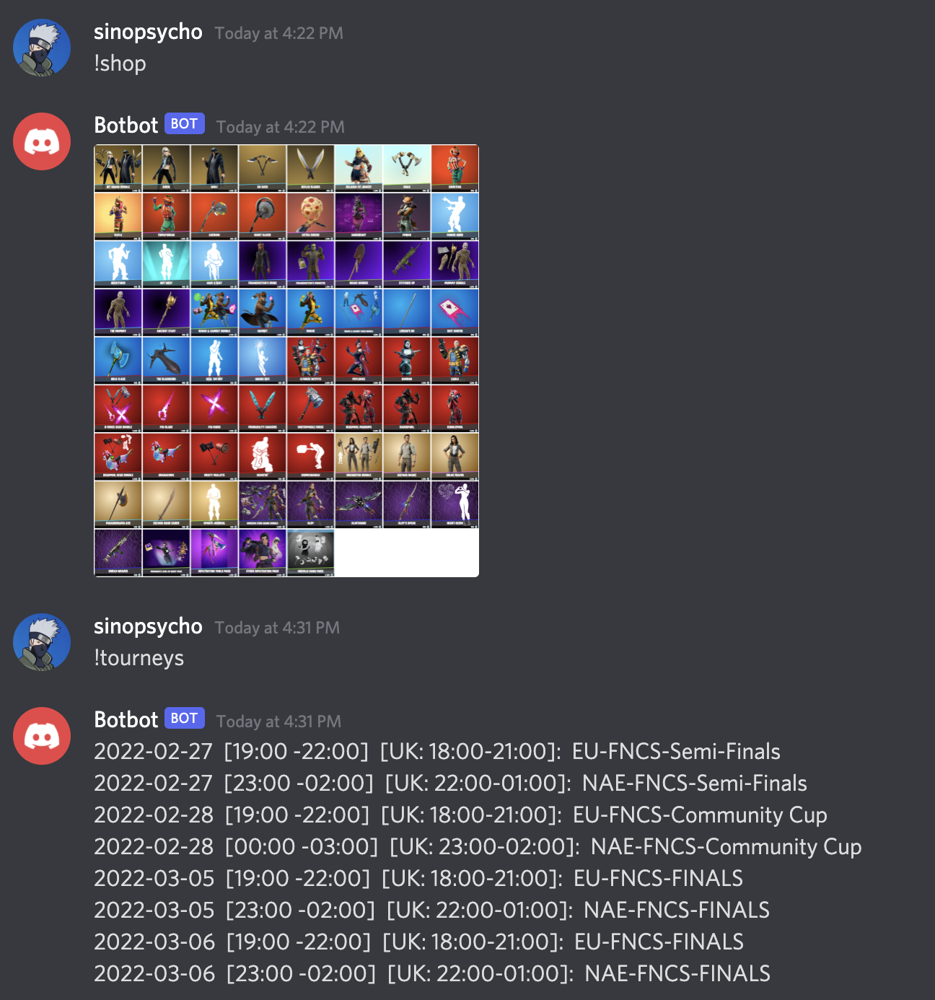

#  Fordibot

## About
Discord bot providing Fortnite-related commands and periodic tasks to your Discord server.

Credits and resources:
* **Discord.py:** https://discordpy.readthedocs.io/en/stable/index.html
* **Fortnite IO API:** https://fortniteapi.io/

## Features
### Commands
#### Example
<p>
  
</p>

#### !shop
Pulls the item shop via API, generates a summary image and posts it in Discord

#### !tourneys
Posts a summary containing all upcoming tournaments. Preferred regions and type of tournaments can be configured.

### Periodic tasks
* Once a day (configurable), it can generate an image with the latest item shop content and post it in a given channel
* Every X (configurable) minutes, it checks whether a tourney is about to start and posts a reminder in a given channel if needed

## Quickstart
### Prepare Discord
You need to register your bot to Discord, and invite the bot to your Discord server. Follow the instructions from https://discordpy.readthedocs.io/en/stable/discord.html . Save the bot token somewhere, you will need it later.

### Get an API key for Fortniteapi.io
This project uses the Fortniteio API. To be able to use it, you need to register here: https://fortniteapi.io/ . Save the api key somewhere, you will need it later.

### Prepare Python
```
python3 -m venv venv
. ./venv/bin/activate
pip install -r requirements.txt
```

### Install wkhtmltopdf
This bot uses the python library `imgkit` to convert html to images. It relies on the lightweight program `wkhtmltopdf` to be installed. Instructions about how to install `wkhtmltopdf`can be found here: https://pypi.org/project/imgkit/ 

### Configuration
You need to create a file called `.env` at the root of this project. This is **very important** as this is where you can add the secret tokens and API keys, and configure further the bot.

Its content should look like:
```
DISCORD_TOKEN="SOME_TOKEN"
FORTNITE_IO_KEY="SOME_API_KEY"
SHOP_CHANNEL_ID="CHANNEL_ID_WHERE_UPDATES_WILL_BE_POSTED"
```
Check the file `settings.py` for more configuration parameters. Look for lines containing `os.getenv()`

### Run the program
```
. ./venv/bin/activate
python -m source.bot.py
```
